💎 Sapphire
===========

A full-stack fitness social platform. The React Native mobile app lets users share workout
posts, chat with an AI fitness assistant, and shop for equipment, all backed by an
Express/PostgreSQL API and a React admin console.

[](https://github.com/fadyabirached/sapphire/actions/workflows/ci.yml)
[](Backend/package.json)
[](Frontend/package.json)
[](Backend/package.json)

🎓 **Bachelor's final year project, graded 97/100 (highest grade of the semester).**

---

## 📸 Screenshots

**Auth & navigation**

<table>
  <tr>
    <td align="center">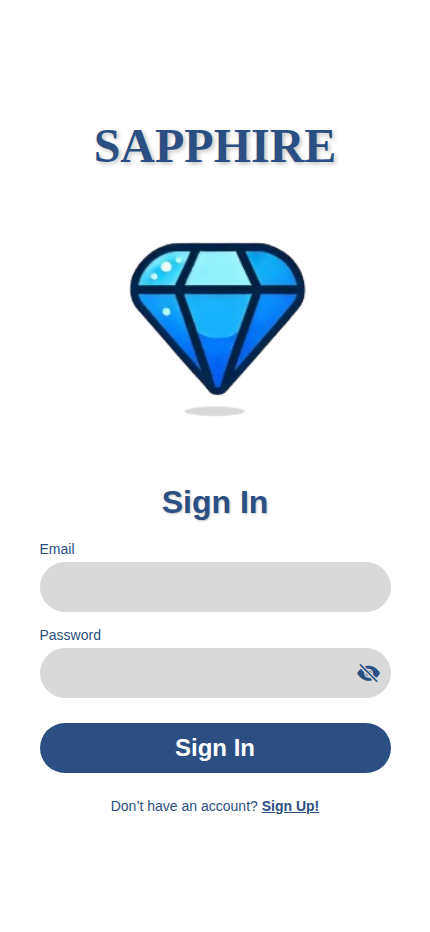<br/>Sign in</td>
    <td align="center">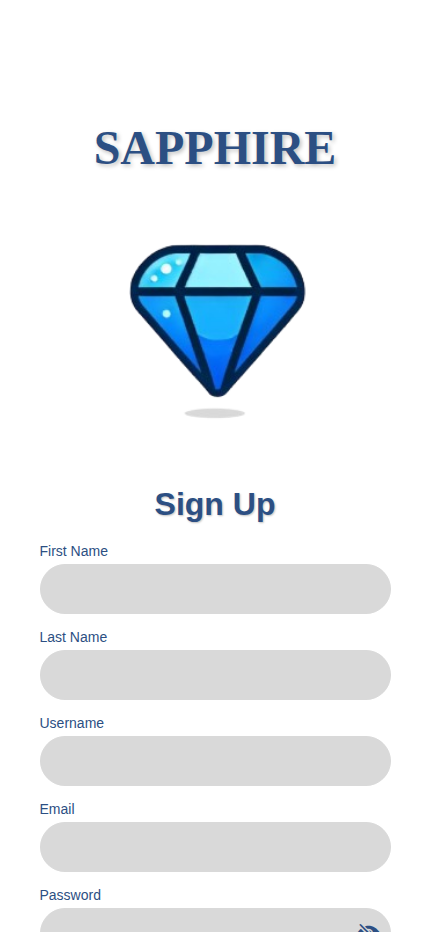<br/>Sign up</td>
    <td align="center">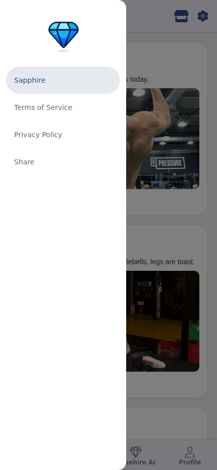<br/>Drawer navigation</td>
  </tr>
</table>

**Social feed & profile**

<table>
  <tr>
    <td align="center">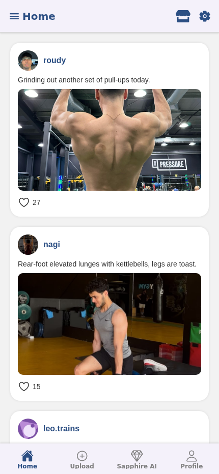<br/>Home feed</td>
    <td align="center">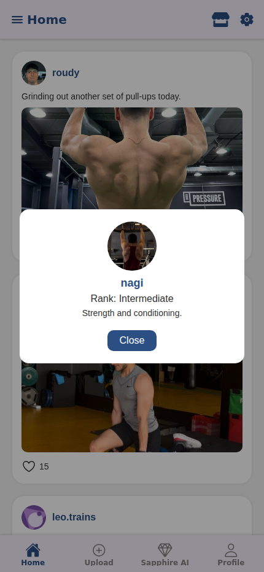<br/>Tap a name for their profile</td>
    <td align="center">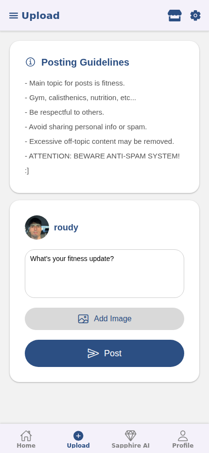<br/>New post</td>
    <td align="center">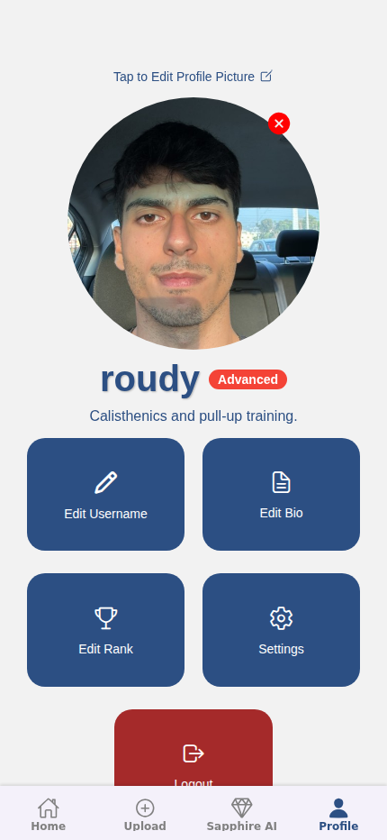<br/>Profile</td>
    <td align="center"><br/>Settings</td>
  </tr>
</table>

**AI moderation in action**

<table>
  <tr>
    <td align="center">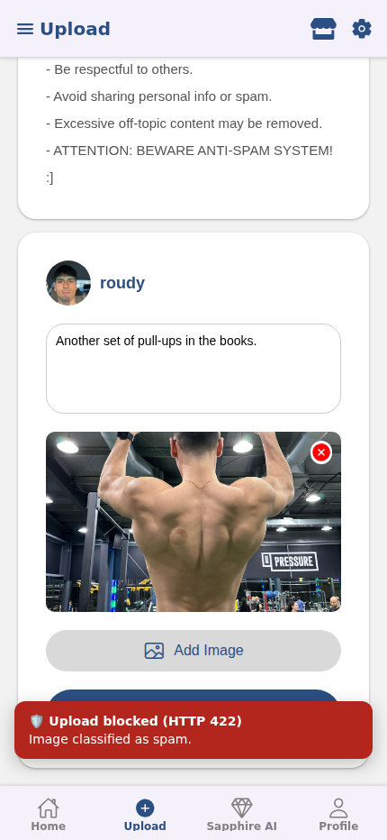<br/>Upload blocked by the moderation gate (simulated flag for demo purposes)</td>
  </tr>
</table>

**AI chatbot**

<table>
  <tr>
    <td align="center">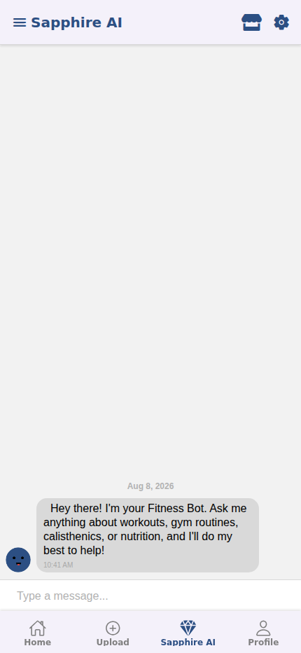<br/>AI fitness chatbot</td>
  </tr>
</table>

**Marketplace**

<table>
  <tr>
    <td align="center">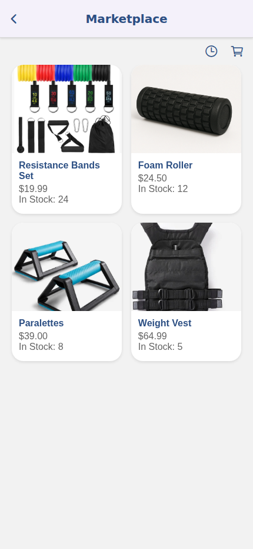<br/>Product catalog</td>
    <td align="center">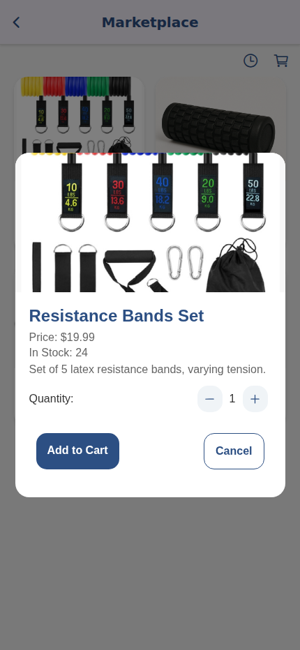<br/>Product detail</td>
    <td align="center">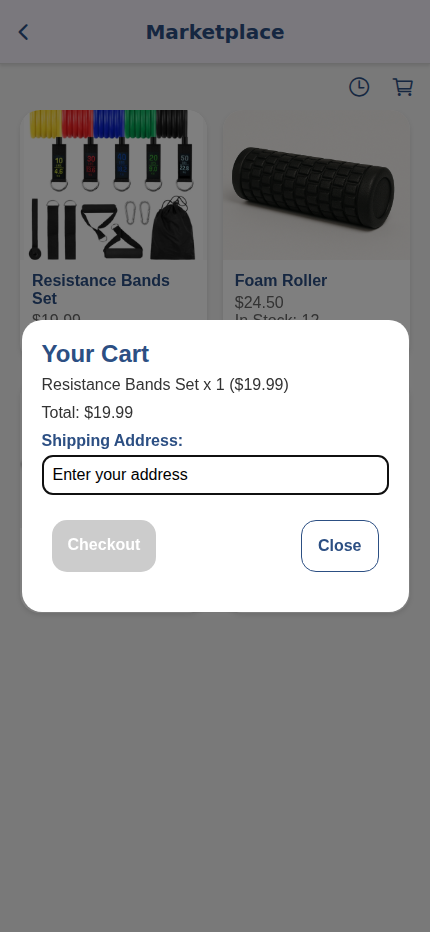<br/>Cart & checkout</td>
  </tr>
</table>

**Admin console**

<table>
  <tr>
    <td align="center">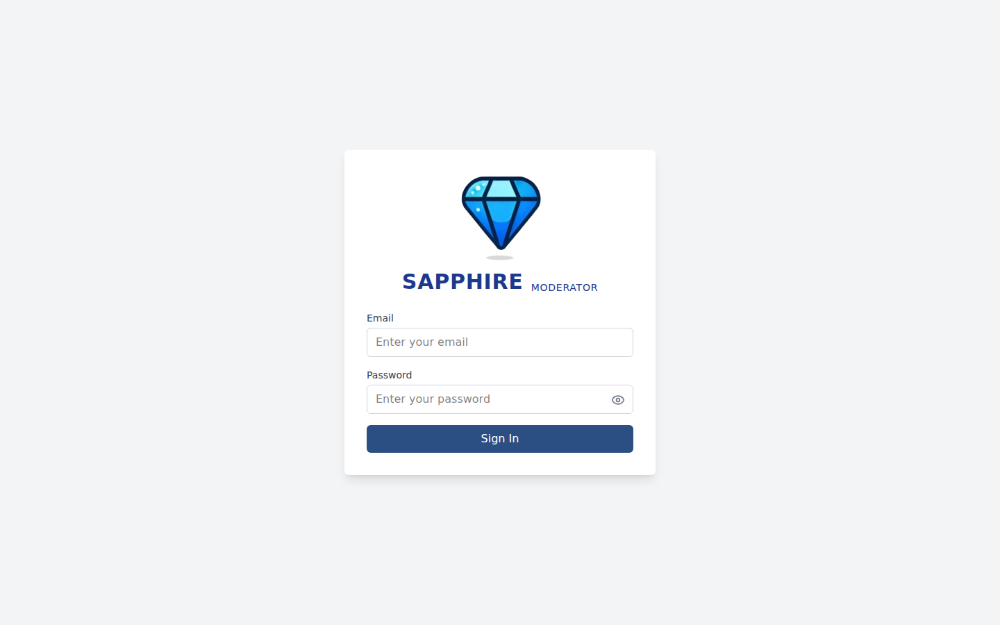<br/>Admin login</td>
    <td align="center">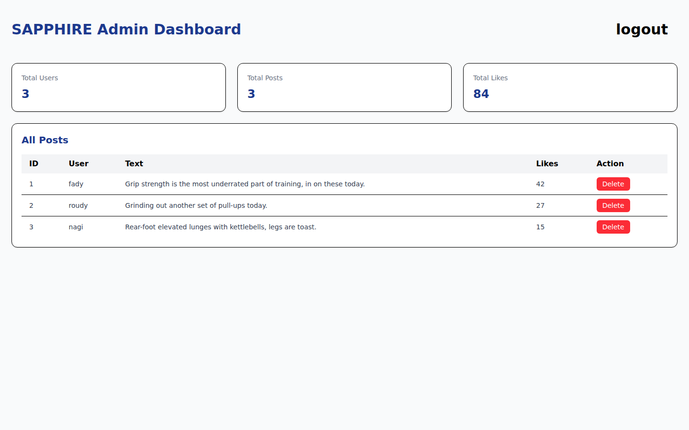<br/>Admin dashboard</td>
  </tr>
</table>

## ✨ Features

- 🔐 **Auth**: bcrypt-hashed passwords, JWT sessions, a separate admin-scoped token for
  the moderation console.
- 📸 **Social feed**: post text + images, like/unlike, per-user profiles with avatars and bios.
- 🤖 **AI fitness chatbot**: an in-app assistant (Cohere `command-xlarge`) that answers
  workout, calisthenics, and nutrition questions, proxied through the backend so the API
  key never ships inside the mobile bundle.
- 🛡️ **AI image moderation**: every uploaded post image is classified by a Hugging Face
  vision model before it's stored. Flagged images are rejected server-side, and the check
  fails closed if the model is unreachable.
- 🛒 **Marketplace**: product catalog, cart, and a transactional checkout that verifies
  stock and updates inventory atomically.
- 📊 **Admin console**: platform stats and post moderation, gated behind a dedicated
  admin login.

## 🏗️ Architecture

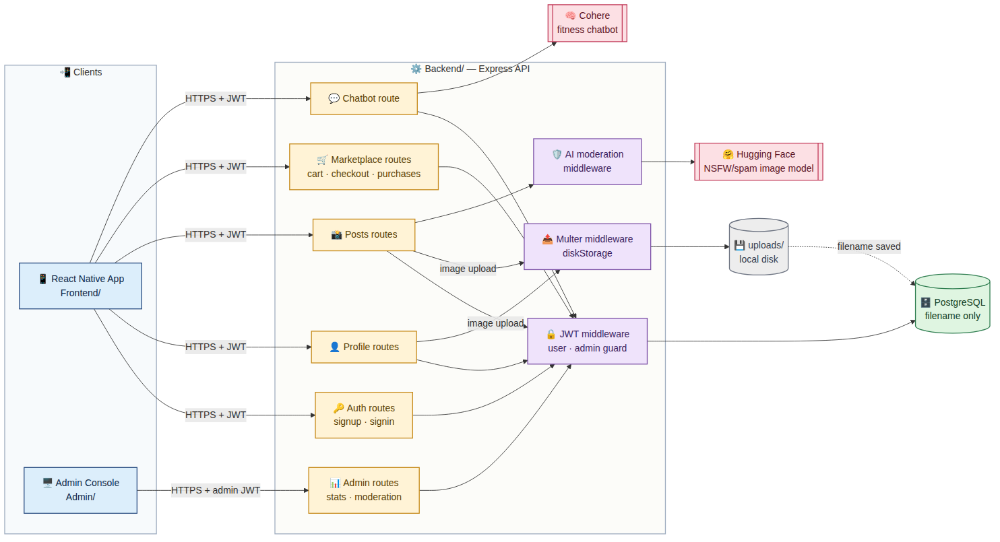

<details>
<summary>Mermaid source (renders on GitHub web, but not in the GitHub mobile app, so the PNG above is the portable version)</summary>

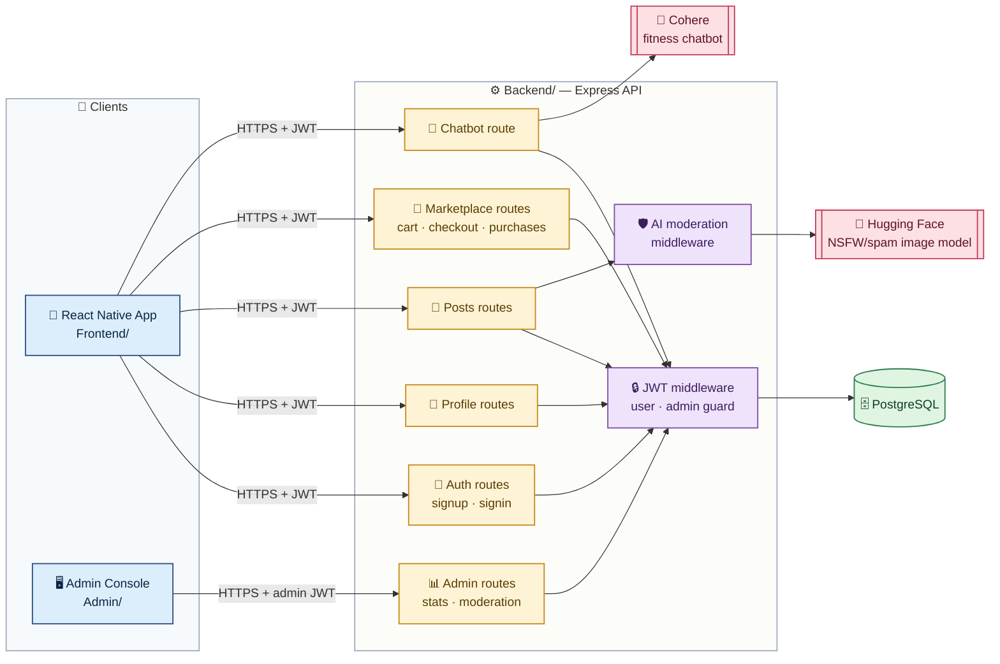

</details>

## 🧰 Tech stack

| Layer | Stack |
|---|---|
| 📱 Mobile | React Native, Expo, React Navigation, React Native Paper |
| 🖥️ Admin | React 19, Vite, Tailwind CSS, React Router |
| ⚙️ Backend | Node.js, Express, PostgreSQL (`pg`), JWT, bcrypt, Multer |
| 🧠 AI/ML | Cohere (chatbot) · Hugging Face Inference API (image moderation) |
| ✅ CI | GitHub Actions: lint + build on every push and pull request |

## 📁 Project structure

```
Backend/
  config/         # DB pool, JWT config
  middleware/      # auth guards, upload handling, AI moderation
  routes/          # auth, profile, posts, marketplace, admin, chatbot
  server.js        # app wiring only
Admin/
  src/pages/       # Login, Dashboard, NotFound
Frontend/
  screens/         # SignIn, SignUp, Home, Upload, Chatbot, Profile, Settings, Marketplace
```

## 🚀 Getting started

### Backend

```bash
cd Backend
cp .env.example .env   # fill in DB, JWT, admin, Hugging Face, and Cohere credentials
npm install
npm run lint
npm start                # http://localhost:3000
```

### Admin console

```bash
cd Admin
npm install
npm run dev               # http://localhost:5173
```

### Mobile app

```bash
cd Frontend
npm install
npm start                 # opens Expo dev tools
```

## 🔒 Security

- All secrets (DB credentials, JWT secret, admin credentials, Hugging Face token, Cohere
  API key) are read from environment variables only, never committed or shipped in a
  client bundle.
- Admin credentials are verified server-side (`ADMIN_EMAIL` / `ADMIN_PASSWORD_HASH`); the
  admin app never has direct access to them.
- The chatbot's Cohere API key lives only on the backend; the mobile app calls `/chatbot`
  with its own JWT instead of talking to Cohere directly.
- Uploaded post images are rejected server-side if the AI moderation check flags them or
  if the moderation service is unreachable (fail-closed).
